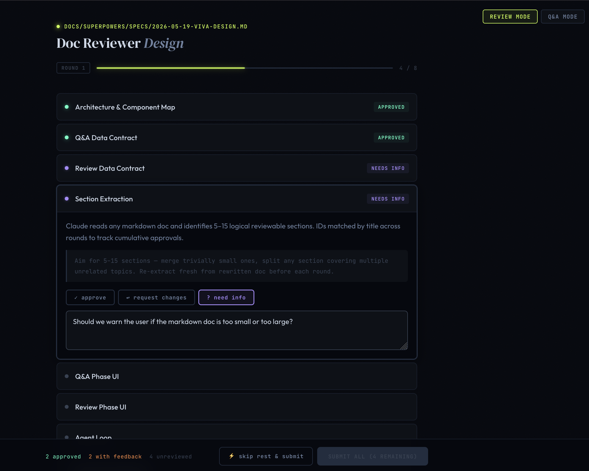

# viva

Section-by-section markdown review for Claude Code. Named after the PhD oral exam: Claude presents its work, you drill every section, Claude defends and revises, the document only passes when it all holds up.



## What it does

`/viva` turns any agent-written markdown document into a structured review session:

1. Claude parses the doc into sections at its markdown headings, no summarising, the cards show the section content verbatim
2. A local browser UI opens — one card per section, each with **approve / skip** section actions plus **request changes / need info** to add typed inline comments
3. You review; Claude rewrites any sections you flag, then loops. Note fields accept image attachments (paste, drag-and-drop, or the 📎 button) — Claude reads each image as part of the rewrite
4. A Revisions ledger in the UI tracks every change request and question (your notes verbatim) and is appended to the doc as `## Revision History` at sign-off
5. The session ends when every section is approved

One browser tab stays open for the entire session. After you submit a round, a spinner appears while Claude rewrites; the next round loads in place without a page reload.

## Installation

Install via the Jacquard Labs marketplace:

```bash
/plugin marketplace add jacquardlabs/marketplace
/plugin install viva@jacquardlabs-marketplace
```

Or install this plugin directly:

```bash
/plugin marketplace add jacquardlabs/viva
/plugin install viva@viva
```

Requires Python 3.8+ and Claude Code.

Or install manually via git clone:

```bash
git clone https://github.com/jacquardlabs/viva ~/.claude/skills/viva
```

## Usage

In Claude Code:

```
/viva path/to/file.md
```

If no path is given, Claude scans the current directory for a single `.md` file.

## Brainstorming integration

viva adds a batch Q&A phase to the `brainstorming` skill via the `/viva-qa`
primitive. When viva is installed, the brainstorming skill calls `/viva-qa`
directly — no install step or patching required.

To collect Q&A answers from your own skills, write `.viva/qa-input.json` and
invoke `/viva-qa`:

```json
{
  "mode": "qa",
  "context": "Topic shown in the title block",
  "questions": [
    {"id": "q1", "text": "Which approach?", "choices": ["A", "B", "C"]}
  ]
}
```

See `.claude/skills/viva/brainstorming-qa.md` for the full contract.

## Verdicts

Each section accepts one or more inline comments (GitHub-style threads), each typed `changes` or `info`. The section's verdict is **derived** from its active comments — any open `changes` comment makes the section `changes`, only `info` comments make it `info`, no active comments leaves it `approved` or `pending`.

| Verdict | What happens |
|---------|-------------|
| `approved` | Section accepted; shown collapsed (green) in subsequent rounds, reopenable if needed |
| `changes` | Claude rewrites the section using your note as the instruction. Select text first to pin the rewrite to that line (`anchor`). Attached images are part of the instruction. |
| `info` | Claude answers your question and rewrites the section incorporating that answer. Select text first to scope the question to that line (`anchor`). Attached images are included as context. |
| `pending` | Skipped; re-presented unchanged next round |

## Diff mode

`/viva-diff` reviews a git diff hunk-by-hunk before a commit:

```
/viva-diff [ref]
```

`ref` is a git ref or range (`HEAD~1`, `main..feature`, etc.). Omit for
unstaged working-tree changes. Each hunk becomes one review card with the
same comment, anchor, and attachment support as document review. Approved
hunks collapse; revised hunks re-present with a within-hunk diff. Sign-off
produces a ledger formatted for a commit body or PR description.

Diff mode is a separate gate from `/code-review` (which is an LLM pass).
They compose: run `/code-review` first, apply its suggestions, then
`/viva-diff` for human sign-off before committing.

## What gets carried across rounds

**Open notes.** Every inline comment is an open thread by default — no opt-in. The exchange (what you asked, what Claude changed or answered) persists round to round and accumulates on the card, with a reply box to continue the conversation GitHub-style, until you settle it. Approving a section settles all of its threads. At sign-off, every thread's full history is appended to the `## Revision History` block.

**Learned preferences.** viva records recurring critiques at sign-off and promotes them to "standing" after 2 distinct sessions. A standing preference auto-flags matching sections (advisory badge) at the start of future reviews, so a known issue is surfaced before you retype it. The store lives in `.viva/preferences.json` (per-clone, gitignored).

**Advisory annotations.** Before arming each round, the agent can run producer passes — `checklist.py` (required-section coverage), `drift.py` (broken file paths / missing symbols), or LLM judgment passes for claim grounding and cross-section contradiction. Each produces color-coded badges on the affected card. Annotations are advisory: they never gate a verdict.

**Round-to-round diff.** Rewritten sections show a collapsible line-level diff vs. the prior round — expand it to see exactly what changed without re-reading the whole section.

## How it works

The server is a single Python file with no dependencies beyond stdlib. Claude Code is the agent, no API key required. Claude launches the server as a background subprocess, polls for the output JSON, and calls HTTP endpoints to signal between rounds.

```
.viva/
├── server.url             ← server writes on startup; deleted on shutdown
├── review-input-r1.json   ← agent writes before round 1
├── review-r1.json         ← server writes after round 1
├── review-input-r2.json   ← agent writes before round 2 (if needed)
├── review-r2.json         ← server writes after round 2
├── open-notes.json        ← persists reviewer threads across rounds (gitignored)
├── preferences.json       ← learned critiques across sessions (gitignored, survives reset)
└── attachments/           ← image attachments from note fields (gitignored)
```

## Server CLI (advanced)

```bash
# Review mode
python3 ~/.claude/skills/viva/server.py \
  --mode review \
  --input .viva/review-input-r1.json \
  --output .viva/review-r1.json

# Q&A mode (brainstorming integration)
python3 ~/.claude/skills/viva/server.py \
  --mode qa \
  --input .viva/qa-input.json \
  --output .viva/answers.json
```

Add `--no-browser` to skip opening a browser tab (useful for testing).
