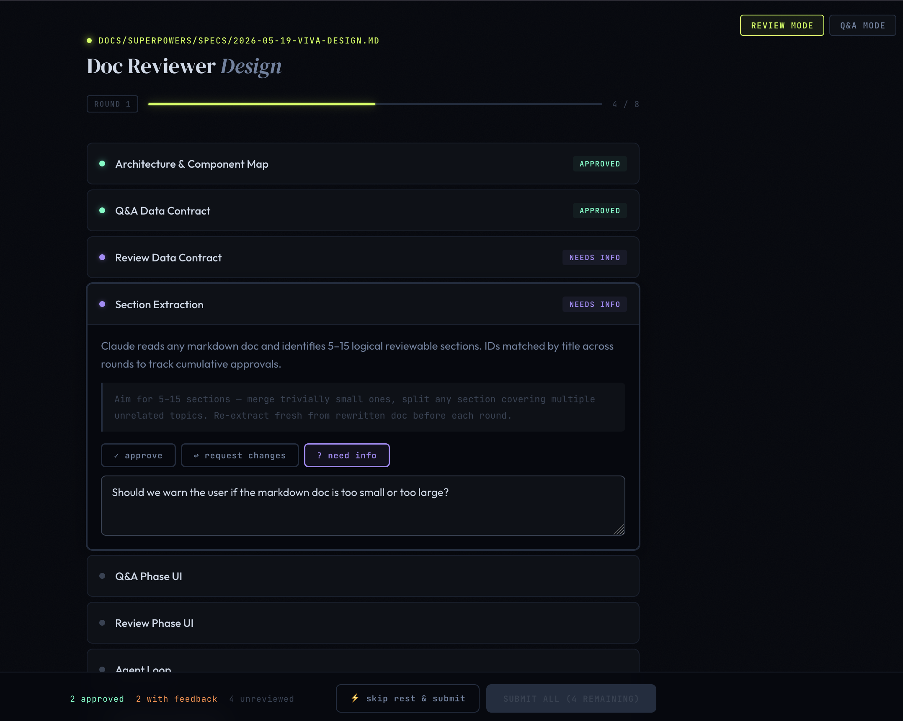

# viva

Section-by-section markdown review for Claude Code. Named after the PhD oral exam: Claude presents its work, you drill every section, Claude defends and revises, the document only passes when it all holds up.

[](https://github.com/jacquardlabs/viva/actions/workflows/test.yml)
[](https://github.com/jacquardlabs/viva/releases)



## Commands

Two commands, split by intent — am I making a thing, or judging one.

| Command | Job |
|---------|-----|
| `/viva-write [type] [path.md] [attachments…]` | Doc-first intake. Pick a document type, attach context, answer only what the attachments couldn't, and the draft goes straight into review. |
| `/viva-review [target]` | Human sign-off. A `.md` path reviews by section; a PR number or git ref reviews by hunk. |

## What it does

`/viva-review` turns any agent-written artifact into a structured review session:

1. Claude parses the target into cards — one per markdown heading, or one per diff hunk. No summarising; cards show content verbatim
2. A local browser UI opens — each card with **approve / skip** plus **request changes / need info** to add typed inline comments
3. You review; Claude rewrites what you flag, then loops. Note fields accept image attachments (paste, drag-and-drop, or the 📎 button) — Claude reads each image as part of the rewrite
4. A Revisions ledger tracks every change request and question (your notes verbatim) and is appended to the doc as `## Revision History` at sign-off
5. The session ends when every card is approved

One browser tab stays open for the entire session. After you submit a round, a spinner appears while Claude rewrites; the next round loads in place without a page reload.

## Doc-first intake

`/viva-write` is the other end of the lifecycle. Instead of composing a doc and
then finding a reviewer, you start from a **type** and the **context** the doc
should be built out of:

```
/viva-write design-doc docs/notifications.md #170 src/notify/ https://example.com/rfc
  1. type       resolve the bundle — section grammar, checks, default pass depth
  2. attach     read the repo paths, files, issue refs, and URLs you named
  3. interview  ask only the RESIDUAL decisions the attachments can't answer
  4. draft      fill the type's section grammar from attachments + answers
  5. hand off   the same tab reflows from Q&A cards to review cards — no relaunch
  6. rounds     editorial review until every section is approved
  7. stamp      commit, or push the body to the PR — per type
```

Every argument is optional. With no type, question one is *what's the
deliverable*; with no path, the interview asks where the draft should land.

**The interview shrinks toward zero as the attachments answer more — it never
reaches zero.** Filling a section from guessed intent is the failure the
questioning exists to prevent, so a question survives for every decision the
attachments leave open. An interview the human submits early stops the draft
rather than letting it guess.

**Attachment kinds** — resolved by `scripts/context_refs.py` into one bounded
manifest:

| Kind | Written as | Read with |
|------|-----------|-----------|
| Issue / PR | `#170`, `owner/repo#170`, a github.com issue or pull URL | `gh` |
| File | `PRODUCT.md`, `assets/flow.png` | file read (images and PDFs included) |
| Directory | `src/notify/` | expanded under a file and byte cap |
| URL | `https://…` | fetch |

"Read the repo" is unbounded, so a directory expands under `--max-files` (20)
and `--max-bytes` (120000), skipping binaries, dotfiles, and `node_modules`-class
directories. Everything a cap excludes is reported rather than silently dropped —
a directory that stopped reading must never look like a directory with nothing
left in it.

Nothing is fetched by the manifest itself: an issue entry carries the exact `gh`
argument list to run. That keeps intake keyless — no API key, no SDK, no stored
token.

## Document types

A type bundle is **section grammar + check set + default pass depth**, one JSON
file per name. Five ship (`design-doc`, `plan`, `readme`, `pr-description`,
`progress-note`); a repo adds or overrides one by committing
`.viva-types/<name>.json`, which wins wholesale on a name collision so it can
drop a shipped check as well as add one.

```bash
python3 "$VIVA_DIR/scripts/doc_types.py" --list        # the menu
python3 "$VIVA_DIR/scripts/doc_types.py" design-doc    # one bundle
```

The type's `checks[]` run as pre-review producers, flagging their findings on the
cards before you see them — `headings-present` reports each expected heading the
draft is missing. Its `default_pass` sets the round's depth: a `checks` type
holds the round open until every check flag has been answered, even with every
section approved.

## Install

**Previously installed via `git clone`?** Delete `~/.claude/skills/viva`
*before* installing the plugin below. A personal skill takes invocation
precedence over a plugin skill of the same name, so a leftover clone shadows
the current version indefinitely.

Install via the Jacquard Labs marketplace:

```bash
/plugin marketplace add jacquardlabs/marketplace
/plugin install viva@jacquardlabs-marketplace
```

Requires Python 3.8+ and Claude Code.

**Upgrading from 1.x?** The commands were renamed, and the old ones are gone —
they resolve to nothing after the upgrade rather than to a deprecation message.

| Was | Now |
|-----|-----|
| `/viva file.md` | `/viva-review file.md` |
| `/viva-diff [ref]` | `/viva-review [ref]` — and `/viva-review <PR#>` is new |
| `/viva-qa` | not a command; the contract is `references/qa.md` |

## Usage

In Claude Code:

```
/viva-review docs/spec.md      # sections
/viva-review 187               # hunks — gh pr diff, merge base included
/viva-review HEAD~3..HEAD      # hunks
/viva-review                   # hunks — unstaged working-tree changes
```

Dispatch is filesystem-first, then shape: a repo holding a file named `187`
means that file, not the pull request. If no target is given, Claude scans the
current directory for a single `.md` file.

## Verdicts

Each card accepts one or more inline comments (GitHub-style threads), each typed `changes`, `info`, or `suggestion`. The card's verdict is **derived** from its active comments — any open `changes` or `suggestion` comment makes it `changes`, only `info` comments make it `info`, no active comments leaves it `approved` or `pending`.

| Verdict | What happens |
|---------|-------------|
| `approved` | Card accepted; shown collapsed (green) in subsequent rounds, reopenable if needed |
| `changes` | Claude rewrites using your note as the instruction. Select text first to pin the rewrite to that line (`anchor`). Attached images are part of the instruction. |
| `info` | Claude answers your question in the thread and does not edit — until the discussion escalates to a `changes` turn. Select text first to scope the question to that line. |
| `pending` | Skipped; re-presented unchanged next round |

**Suggested edits.** Select a span and supply the exact replacement wording. Claude pastes it verbatim — no rewrite pass, no interpretation, nothing outside the span — and the ledger records your wording. A card carrying a live suggestion is never approved.

**Declining.** Claude complies by default, but may push back with grounds — a criterion, a prior ruling, a measurement. Taste is not grounds. A decline settles nothing: the thread carries forward marked `declined` and holds its card until you accept it or insist. **Insisting wins**, and there is no second decline on a thread.

## Hunk review

Point `/viva-review` at a PR number or git ref and the unit of trust becomes the
hunk instead of the section. Each hunk is one card with the same comment, anchor,
and attachment support as document review, grouped under per-file headers. Hunks
render side-by-side with word-level intra-line highlighting (via diff2html;
line-by-line below 900px viewports, dark/light aware), and the page widens to
`min(95vw, 1600px)` — code wants more room than prose. Approved hunks collapse;
revised hunks re-present for a fresh verdict. Sign-off produces a ledger
formatted for a commit body or PR description.

Reviewing a PR you're not checked out on is read-only — the rewrite step edits
working-tree files, so `gh pr checkout <n>` first if you intend to revise.

viva is a separate gate from `/code-review` (which is an LLM pass). They compose:
run `/code-review` first, apply its suggestions, then `/viva-review` for human
sign-off before committing.

## Q&A as a primitive

The batch-question gate `/viva-write` uses for its interview is callable
directly: write `.viva/qa-input.json`, launch `server.py --mode qa`, and read
`.viva/answers.json`.

```json
{
  "mode": "qa",
  "context": "Topic shown in the title block",
  "questions": [
    {"id": "q1", "text": "Which approach?", "choices": ["A", "B", "C"]}
  ]
}
```

`references/qa.md` in the plugin is the full contract, including the hand-off
that reflows the same tab from Q&A cards into review cards without a second
launch — the mechanism `/viva-write` step 5 drives.

## What gets carried across rounds

**Open notes.** Every inline comment is an open thread by default — no opt-in. The exchange (what you asked, what Claude changed or answered) persists round to round and accumulates on the card, with a reply box to continue the conversation GitHub-style, until you settle it. Approving a section settles all of its threads. At sign-off, every thread's full history is appended to the `## Revision History` block.

**Learned preferences.** viva records recurring critiques at sign-off and promotes them to "standing" after 2 distinct sessions. A standing preference auto-flags matching sections (advisory badge) at the start of future reviews, so a known issue is surfaced before you retype it. The store lives in `.viva/preferences.json` (per-clone, gitignored).

**Advisory annotations.** Before arming each round, the agent can run producer passes — `headings_present.py` (the doc type's expected sections), `checklist.py` (required-section coverage), `drift.py` (broken file paths / missing symbols), or LLM judgment passes for claim grounding and cross-section contradiction. Each produces color-coded badges on the affected card. Annotations are advisory: they never gate a verdict.

**Pass depth.** A round runs at a depth — `architecture`, `line`, `checks`, or `final` — set by the doc type or named per round. A pass may only **add** a condition to the all-approved base, never relax it: a `checks` round stays open until every check flag has been answered, a `final` round until no suggested edit is unresolved.

**Round-to-round diff.** Rewritten sections show a collapsible line-level diff vs. the prior round — expand it to see exactly what changed without re-reading the whole section.

## How it works

The server is a single Python file with no dependencies beyond stdlib. Claude Code is the agent, no API key required. Claude launches the server as a background subprocess, polls for the output JSON, and calls HTTP endpoints to signal between rounds. `scripts/loop.py` is the driver that owns the bookkeeping — round numbers, the state clear, liveness, and the sign-off guard — so the skills carry judgment work only.

```
.viva/
├── server.url             ← server writes on startup; deleted on shutdown
├── qa-input.json          ← the interview's questions (/viva-write)
├── answers.json           ← server writes when the human submits them
├── review-input-r1.json   ← agent writes before round 1
├── review-r1.json         ← server writes after round 1
├── review-input-r2.json   ← agent writes before round 2 (if needed)
├── review-r2.json         ← server writes after round 2
├── open-notes.json        ← persists reviewer threads across rounds (gitignored)
├── preferences.json       ← learned critiques across sessions (gitignored, survives reset)
└── attachments/           ← image attachments from note fields (gitignored)
```

Everything under `.viva/` is disposable and reset at the start of each session —
`preferences.json` is the one documented survivor. Type bundles live outside it,
in the repo's committed `.viva-types/`, because they are shared configuration
rather than round state.

## Server CLI (advanced)

Resolve `$VIVA_DIR` from the installed plugin cache first — the same
resolve every skill uses internally:

```bash
VIVA_DIR=$(find ~/.claude/plugins/cache -maxdepth 6 -path "*/viva/*" -name server.py -print0 2>/dev/null \
           | xargs -0 -r ls -t 2>/dev/null | head -1)
VIVA_DIR=${VIVA_DIR%/server.py}
[ -f "$VIVA_DIR/server.py" ] || { echo "viva: server.py not found — install the viva plugin (/plugin install viva@jacquardlabs-marketplace)"; exit 1; }

# Review mode
python3 "$VIVA_DIR/server.py" \
  --mode review \
  --input .viva/review-input-r1.json \
  --output .viva/review-r1.json

# Q&A mode
python3 "$VIVA_DIR/server.py" \
  --mode qa \
  --input .viva/qa-input.json \
  --output .viva/answers.json
```

### Custom section splitting (`--split-on`)

By default `parse_sections.py` auto-detects the split level (see [How it
works](#how-it-works)). For documents with a fixed heading convention that
auto-detection can't be trusted to pick out — a plan document's `### Task 1`,
`### Task 2`, … blocks, for example — pass `--split-on` to split on any
heading whose title matches a regex, regardless of heading depth:

```bash
# Round 1 ($VIVA_DIR resolved as in Server CLI above)
python3 "$VIVA_DIR/scripts/parse_sections.py" PLAN.md \
  --output .viva/review-input-r1.json --round 1 \
  --split-on '^Task \d+'

# Round 2+
python3 "$VIVA_DIR/scripts/parse_sections.py" PLAN.md \
  --output .viva/review-input-r2.json --round 2 \
  --prior-input .viva/review-input-r1.json \
  --prior-verdicts .viva/review-r1.json \
  --split-on '^Task \d+'
```

`--split-on` takes a Python regex (`re.search`, case-sensitive — add `(?i)`
inline for case-insensitive matching), matched against each heading's title
text. It's optional: omit it and parsing is byte-for-byte the default
auto-detect behavior above; a pattern that matches no heading in the
document is a hard error rather than a silent fallback. Section identity
carries through `schema.section_key()` unmodified either way, so approvals,
annotations, round-to-round diffs, and open-note threads all work across
rounds with no extra bookkeeping on the caller's side.

Add `--no-browser` to skip opening a browser tab (useful for testing).

## Contributing

Tests are stdlib-only, one file per module, each self-running via its own `main()`:

```bash
for f in tests/test_*.py; do python3 "$f"; done
```

CI (`.github/workflows/test.yml`) runs this loop across Python 3.8–3.13 on every push and pull request.

## License

MIT, as declared in [`.claude-plugin/plugin.json`](.claude-plugin/plugin.json).

> TODO: no `LICENSE` file exists at the repo root. Add one so the declared license is enforceable and shows up on GitHub's license detector.
