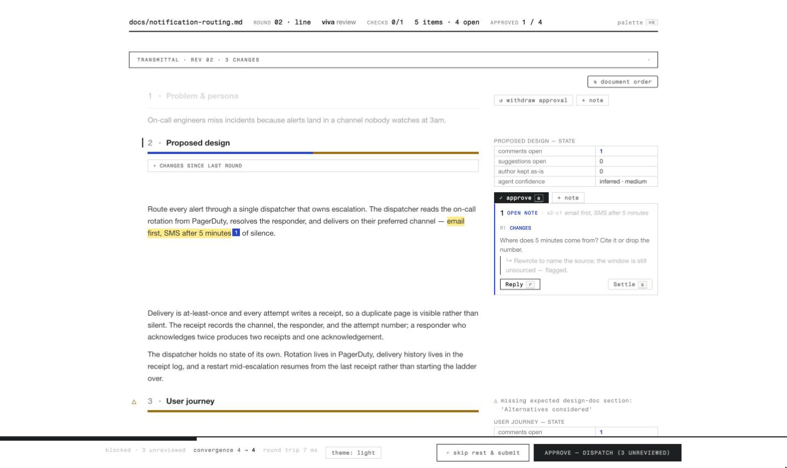
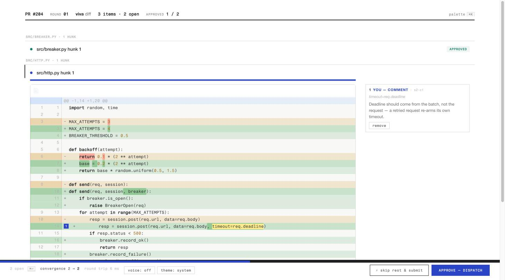
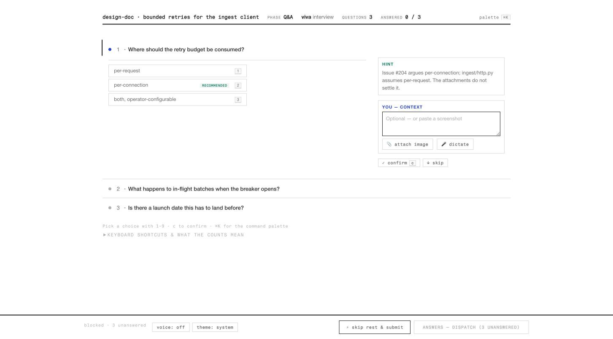

# viva

**Human checkpoints for the documents and code an agent writes.** Claude presents its work section by section, you drill each one, Claude defends and revises — and nothing passes until you approve the section it lives in.

[](https://github.com/jacquardlabs/viva/actions/workflows/test.yml)
[](https://github.com/jacquardlabs/viva/releases)
[](#license)

<picture>
  <source media="(prefers-color-scheme: dark)" srcset="assets/review-dark.jpg">
  
</picture>

<sub>Round 2 of a `design-doc` review at `line` depth. The reviewer's thread sits in the margin beside the sentence it questions; the gutter flags a missing section; the footer holds the stamp.</sub>

## Why

An agent will tell you the document is done. It is not done because the agent says so — but reading 2,000 words to find the three sentences that are wrong is worse than writing it yourself, so the review gets skipped and the doc ships unchecked.

viva makes the gate cheap enough to use every time. One local browser tab, one card per section, four keystrokes per verdict. **The unit of trust is the section, not the document.** Nothing is auto-accepted, ever.

## Quick start

```bash
/plugin marketplace add jacquardlabs/marketplace
/plugin install viva@jacquardlabs-marketplace
```

Then, in Claude Code:

```
/viva-review docs/spec.md        # review a doc you already have
/viva-write design-doc #170      # write one from an issue, then review it
```

Requires Python 3.8+ and Claude Code. No API key, no hosted service, no npm — a single stdlib-only Python server and a browser tab.

<details>
<summary><b>Upgrading from 1.x?</b> The commands were renamed.</summary>

The old names resolve to nothing after the upgrade rather than to a deprecation message.

| Was | Now |
|-----|-----|
| `/viva file.md` | `/viva-review file.md` |
| `/viva-diff [ref]` | `/viva-review [ref]` — and `/viva-review <PR#>` is new |
| `/viva-qa` | not a command; the contract is `references/qa.md` |

**Previously installed via `git clone`?** Delete `~/.claude/skills/viva` before installing. A personal skill takes invocation precedence over a plugin skill of the same name, so a leftover clone shadows the current version indefinitely.

</details>

## Two commands

Split by **intent** — am I making a thing, or judging one.

| Command | Job |
|---------|-----|
| `/viva-write [type] [path.md] [attachments…]` | Pick a document type, attach context, answer only what the attachments couldn't, and the draft goes straight into review. |
| `/viva-review [target]` | Human sign-off. A `.md` path reviews by section; a PR number or git ref reviews by hunk. |

---

## `/viva-review` — the gate

```
/viva-review docs/spec.md      # sections
/viva-review 187               # hunks — gh pr diff, merge base included
/viva-review HEAD~3..HEAD      # hunks
/viva-review                   # hunks — unstaged working-tree changes
```

Dispatch is filesystem-first, then shape: a repo holding a file named `187` means that file, not the pull request. With no target, Claude scans the current directory for a single `.md`.

Claude parses the target into cards — one per markdown heading, or one per diff hunk — and opens a local browser UI. Cards show content **verbatim**; viva never paraphrases you or the document. You review, Claude rewrites what you flagged, and the next round loads in the same tab with no page reload. The session ends when every card is approved, and a `## Revision History` ledger recording your notes verbatim is appended to the doc.

<picture>
  <source media="(prefers-color-scheme: dark)" srcset="assets/hunks-dark.jpg">
  
</picture>

<sub>`/viva-review 187` — the unit of trust is the hunk. Word-level intra-line highlighting; approved hunks collapse, revised ones re-present.</sub>

Reviewing a PR you're not checked out on is read-only: the rewrite step edits working-tree files, so run `gh pr checkout <n>` first if you intend to revise. Sign-off produces a ledger formatted for a commit body or PR description.

viva is a **human gate**, not an LLM reviewer. It composes with `/code-review` (which is an LLM pass): run that first, apply its suggestions, then `/viva-review` for human sign-off before committing.

### Verdicts

Each card takes one or more inline comments (GitHub-style threads), typed `changes`, `info`, or `suggestion`. The verdict is **derived** from the active comments — never picked directly.

| Verdict | What happens |
|---------|-------------|
| `approved` | Card accepted; collapsed in later rounds, reopenable |
| `changes` | Claude rewrites using your note as the instruction. Select text first to pin the edit to that line. |
| `info` | Claude answers in the thread and does **not** edit — until the discussion escalates to a `changes` turn. |
| `pending` | Skipped; re-presented unchanged next round |

**Suggested edits.** Select a span and supply the exact replacement wording. Claude pastes it verbatim — no rewrite pass, no interpretation, nothing outside the span — and the ledger records your wording. A card carrying a live suggestion is never approved.

**Declining.** Claude complies by default but may push back with grounds — a criterion, a prior ruling, a measurement. Taste is not grounds. A decline settles nothing: the thread carries forward marked `declined` and holds its card until you accept it or insist. **Insisting wins**, and there is no second decline on a thread.

Note fields take image attachments (paste, drag-and-drop, or 📎) and Claude reads each one as part of the rewrite.

---

## `/viva-write` — doc-first intake

The other end of the lifecycle. Instead of composing a document and then finding a reviewer, you start from a **type** and the **context** the document should be built out of:

```
/viva-write design-doc docs/notifications.md #170 src/notify/ https://example.com/rfc
  1. type       resolve the bundle — section grammar, checks, default pass depth
  2. attach     read the repo paths, files, issue refs, and URLs you named
  3. interview  ask only the RESIDUAL decisions the attachments can't answer
  4. draft      fill the type's section grammar from attachments + answers
  5. hand off   the same tab reflows from Q&A cards to review cards — no relaunch
  6. rounds     editorial review until every section is approved
  7. stamp      commit, or push the body to the PR — per type
```

Every argument is optional. With no type, question one is *what's the deliverable*; with no path, the interview asks where the draft should land.

<picture>
  <source media="(prefers-color-scheme: dark)" srcset="assets/interview-dark.jpg">
  
</picture>

<sub>Step 3. The attachments answered everything else; these are what's left.</sub>

**The interview shrinks toward zero as the attachments answer more — it never reaches zero.** Filling a section from guessed intent is the failure the questioning exists to prevent, so a question survives for every decision the attachments leave open. An interview you submit early stops the draft rather than letting it guess.

### Attachments

Resolved by `scripts/context_refs.py` into one bounded manifest:

| Kind | Written as | Read with |
|------|-----------|-----------|
| Issue / PR | `#170`, `owner/repo#170`, a github.com issue or pull URL | `gh` |
| File | `PRODUCT.md`, `assets/flow.png` | file read (images and PDFs included) |
| Directory | `src/notify/` | expanded under a file and byte cap |
| URL | `https://…` | fetch |

"Read the repo" is unbounded, so a directory expands under `--max-files` (20) and `--max-bytes` (120000), skipping binaries, dotfiles, and `node_modules`-class directories. **Everything a cap excludes is reported rather than silently dropped** — a directory that stopped reading must never look like a directory with nothing left in it.

Nothing is fetched by the manifest itself: an issue entry carries the exact `gh` argument list to run. That is what keeps intake keyless — no API key, no SDK, no stored token.

---

## Document types

A type bundle is **section grammar + check set + default pass depth**, one JSON file per name. Five ship (`design-doc`, `plan`, `readme`, `pr-description`, `progress-note`); a repo adds or overrides one by committing `.viva-types/<name>.json`, which wins wholesale on a name collision so it can drop a shipped check as well as add one.

Invoking `/viva-write` with no type asks *what's the deliverable* and offers the
merged menu — the shipped bundles plus whatever your repo committed. (The
resolver behind it is `scripts/doc_types.py`; see **Server CLI** below for
running it by hand.)

The type's `checks[]` run as pre-review producers, flagging findings on the cards before you see them — `headings-present` reports each expected heading the draft is missing.

**Pass depth.** A round runs at a depth — `architecture`, `line`, `checks`, or `final` — set by the type or named per round. A pass may only **add** a condition to the all-approved base, never relax it: a `checks` round stays open until every check flag has been answered, a `final` round until no suggested edit is unresolved.

## What carries across rounds

**Open notes.** Every inline comment is a thread by default — no opt-in. The exchange (what you asked, what Claude changed or answered) persists round to round and accumulates in the margin, with a reply box to continue GitHub-style, until you settle it. Approving a card settles all of its threads. At sign-off, every thread's full history lands in the ledger.

**Learned preferences.** viva records recurring critiques at sign-off and promotes them to "standing" after 2 distinct sessions. A standing preference auto-flags matching sections before you retype the note. The store is per-clone and gitignored.

**Advisory annotations.** Producers run before each round is armed — `headings_present.py` (the type's expected sections), `checklist.py` (required-section coverage), `drift.py` (broken file paths, missing symbols), plus LLM passes for claim grounding and cross-section contradiction. They decorate the card; they never gate a verdict.

**Round-to-round diff.** Rewritten sections carry a collapsible line-level diff against the prior round, so you can see exactly what changed without re-reading the whole thing.

## How it works

A single Python file with no dependencies beyond stdlib. Claude Code is the agent, so there is no API key. Claude launches the server as a background subprocess, polls for the output JSON, and calls HTTP endpoints to signal between rounds. `scripts/loop.py` is the driver that owns the bookkeeping — round numbers, the state clear, liveness, and the sign-off guard — so the skills carry judgment work only.

```
.viva/
├── server.url             ← server writes on startup; deleted on shutdown
├── qa-input.json          ← the interview's questions (/viva-write)
├── answers.json           ← server writes when you submit them
├── review-input-r1.json   ← agent writes before round 1
├── review-r1.json         ← server writes after round 1
├── open-notes.json        ← reviewer threads across rounds (gitignored)
├── preferences.json       ← learned critiques (gitignored, survives reset)
└── attachments/           ← image attachments from note fields (gitignored)
```

Everything under `.viva/` is disposable and reset at the start of each session — `preferences.json` is the one documented survivor. Type bundles live outside it, in the repo's committed `.viva-types/`, because they are shared configuration rather than round state.

`docs/headless-contract.md` is the full contract for a program driving `server.py` directly.

<details>
<summary><b>Server CLI</b> — driving the pieces by hand</summary>

Resolve `$VIVA_DIR` from the installed plugin cache first — the same resolve every skill uses internally:

```bash
VIVA_DIR=$(find ~/.claude/plugins/cache -maxdepth 6 -path "*/viva/*" -name server.py -print0 2>/dev/null \
           | xargs -0 -r ls -t 2>/dev/null | head -1)
VIVA_DIR=${VIVA_DIR%/server.py}
[ -f "$VIVA_DIR/server.py" ] || { echo "viva: server.py not found — install the viva plugin (/plugin install viva@jacquardlabs-marketplace)"; exit 1; }

# Review mode
python3 "$VIVA_DIR/server.py" --mode review \
  --input .viva/review-input-r1.json --output .viva/review-r1.json

# Q&A mode
python3 "$VIVA_DIR/server.py" --mode qa \
  --input .viva/qa-input.json --output .viva/answers.json

# Doc types — the merged menu, and one resolved bundle
python3 "$VIVA_DIR/scripts/doc_types.py" --list
python3 "$VIVA_DIR/scripts/doc_types.py" design-doc
```

Add `--no-browser` to skip opening a tab.

### Custom section splitting (`--split-on`)

By default `parse_sections.py` splits on the highest heading level occurring more than once. For a document with a fixed heading convention that auto-detection can't be trusted to pick out — a plan's `### Task 1`, `### Task 2`, … blocks — pass `--split-on` to split on any heading whose title matches a regex, at any depth:

```bash
python3 "$VIVA_DIR/scripts/parse_sections.py" PLAN.md \
  --output .viva/review-input-r1.json --round 1 \
  --split-on '^Task \d+'
```

It takes a Python regex (`re.search`, case-sensitive — add `(?i)` inline for case-insensitive), matched against each heading's title text. A pattern matching no heading is a hard error rather than a silent fallback. The pattern is recorded in the round file, so later rounds and a later resume re-split identically.

</details>

## Contributing

Tests are stdlib-only, one file per module, each self-running via its own `main()`:

```bash
for f in tests/test_*.py; do python3 "$f"; done
```

CI runs this loop across Python 3.8–3.13 on every push and pull request. New features need a test; bug fixes need a regression test.

## License

MIT, as declared in [`.claude-plugin/plugin.json`](.claude-plugin/plugin.json).

> TODO: no `LICENSE` file exists at the repo root. Add one so the declared license is enforceable and shows up on GitHub's license detector.
