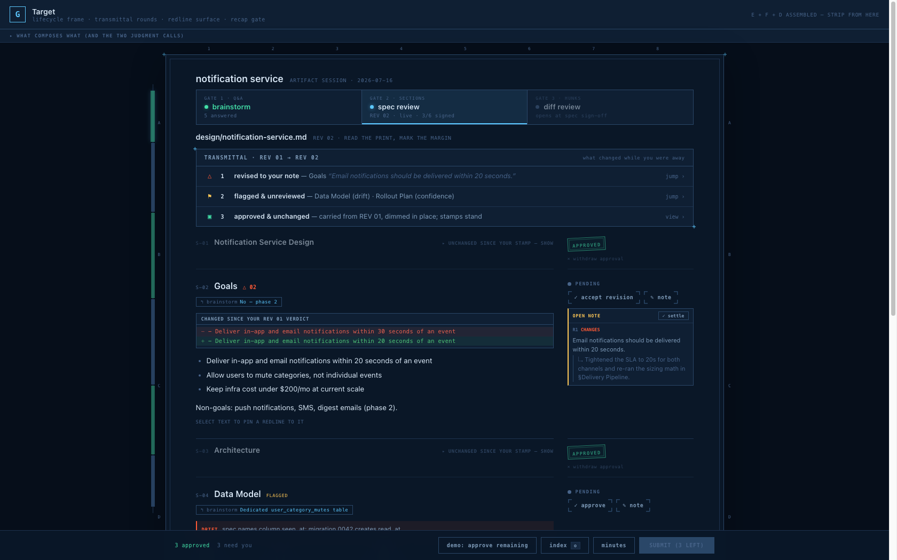
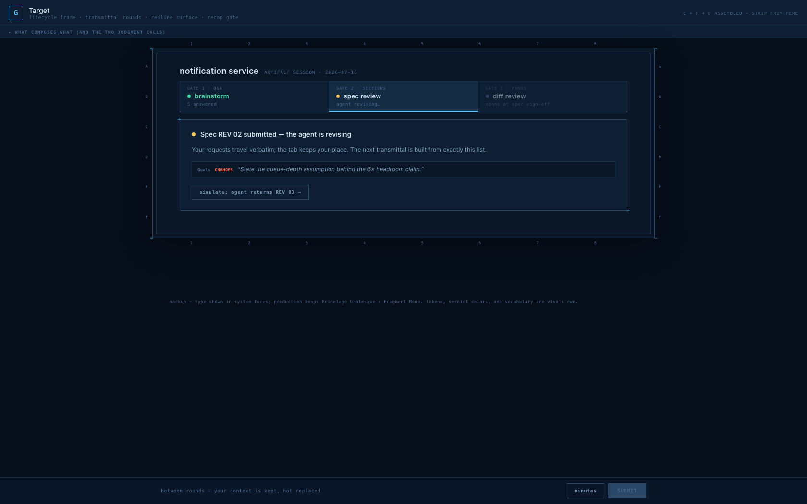
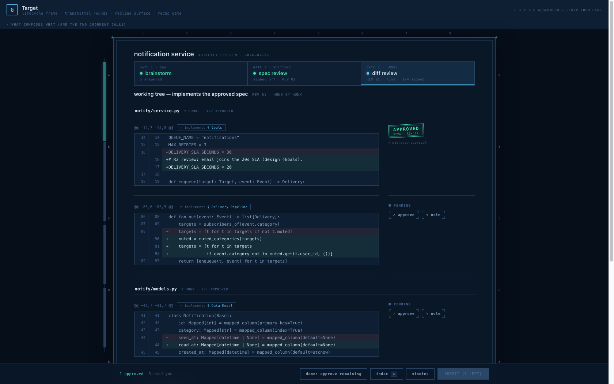
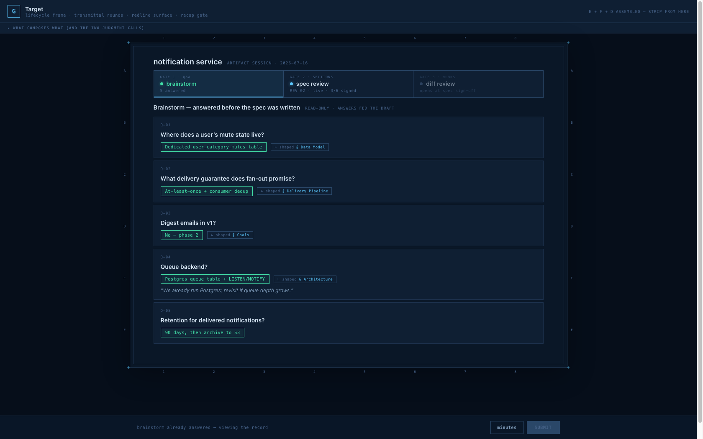
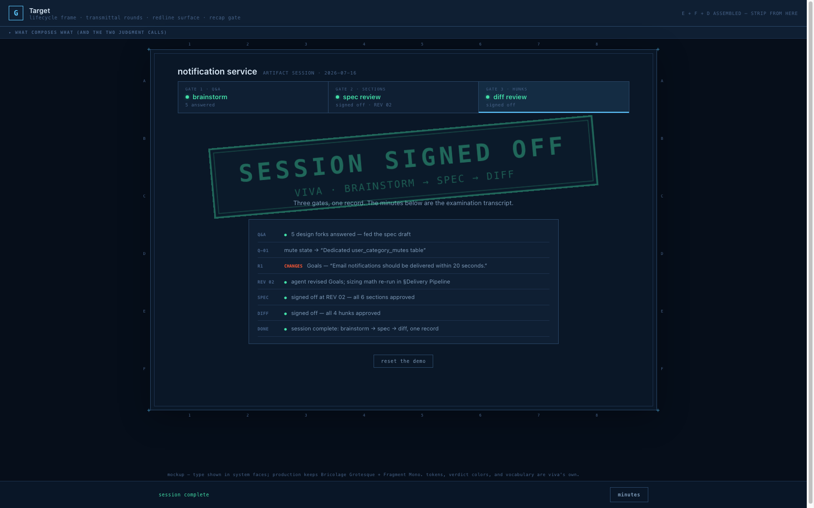
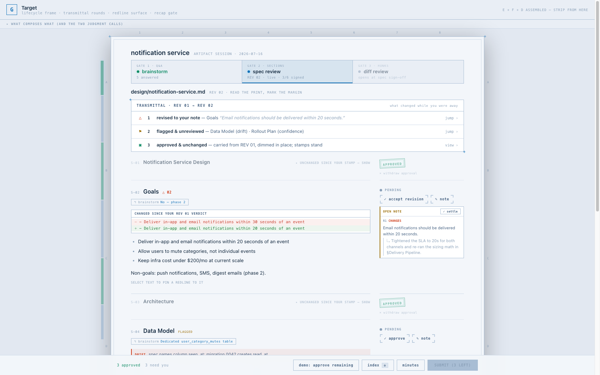

# Design: Frontend v2 — the target review surface

**Date:** 2026-07-16
**Issue:** not yet filed — exploration story; implementation issues carve out per phase below
**Status:** Draft — revised 2026-07-17 per design-review REVISE (spine phasing, slip attribution, ground rationale, reload behavior, journey + ops sections); pending re-review
**Interactive demo:** [G · Target](https://claude.ai/code/artifact/26ecd36b-2323-4a28-8253-baafaec072c7) (private artifact; every screenshot below is captured from it unmodified)
**Exploration record:** 8 interactive mockups, A–H — see Appendix

---

## Problem & persona

The current frontend — the embedded `HTML` constant in `server.py` — was designed
for exactly one checkpoint: section-by-section markdown review. A 700px
single-column accordion, one active card at a time, auto-advance on approve, a
fixed bottom bar. PRODUCT.md has since widened the product definition:

> The product is the set of **human checkpoints across an agent's artifact
> lifecycle** — today the review checkpoint (section-by-section doc review), a
> brainstorm checkpoint (batch Q&A before the doc exists), and a diff checkpoint
> (hunk-by-hunk code review before a commit).

Diff and Q&A were fitted into the review layout rather than designed for:
`mode-diff` widens the same shell to `min(95vw, 1600px)` but keeps the
one-hunk-at-a-time accordion; Q&A relabels the titleblock cells and the submit
button. Four costs follow, for the reviewing human persona:

1. **No persistent overview.** A 40-hunk diff or 12-section doc renders as a
   wall of collapsed rows; "which card has feedback?" means scrolling.
2. **One-open-card-at-a-time fights code reading.** Hunks of one file want to
   be read together, in order; the accordion collapses all but one.
3. **Round N renders as "the same page again."** The reviewer re-derives what
   changed since their last verdicts; prior approvals collapse but everything
   else rebuilds identically. The multi-round loop is viva's core, and it is
   the least-designed moment in the UI.
4. **Transitions discard context.** The processing state replaces the whole
   view with a spinner; the #109 qa→review hand-off reflows the tab with no
   visible relationship between what the human answered and what they now review.

## Proposed design

One surface built from three composed interaction layers plus a visual ground.
Each layer traces to a standalone mockup that was evaluated against
alternatives before being kept (Appendix):

| Layer | Origin | What it contributes |
|---|---|---|
| **Lifecycle frame** | mockup E | The session — not the page — is the object: a timeline of gates (brainstorm → spec review → diff review) in one tab. Provenance chips link items across gates; the ledger grows into session-wide minutes. |
| **Transmittal rounds** | mockup F | Any gate at round ≥ 2 opens with a transmittal slip — drafting's re-issue ritual: revised (attributed to the reviewer's note only when one stands behind the diff), threads answered, flagged & unreviewed, carried approvals. Between rounds, the reviewer's requests stay on screen verbatim. |
| **Redline surface** | mockup D (= B + A + C) | The live gate is a continuous print, not an accordion. The reviewer's markup lives in the margin: approve stamps it, text selection pins a note, threads sit beside the passage they question. A spine minimap carries position + verdict state; submit routes through a recap overlay. |
| **Sheet ground** | mockup H, option 5 (amended) | The document is a bounded drawing sheet on a dark flat table — border, inner rule, corner registration marks, edge coordinates. No background grid at any layer. Serves none of the four costs above: it is decoupled metaphor paydown (the grid was decoration, not structure) that rides phase 1 because it is CSS-only and de-risks phase 2's larger visual change — judge phase 1's success against the four costs, not the ground. |

Two composition judgment calls, made explicit because they resolve real
conflicts between the layers:

- **Document order stays canonical.** F's triage ordering lives in the
  transmittal slip's jump links and the spine coloring — the print itself never
  reorders. (Same posture as the existing confidence sort: document order is
  the default, attention-routing is an overlay.)
- **Carried approvals collapse in place.** Sections approved in a prior round
  and unchanged since render as dimmed one-liners with their stamp in the
  margin — expandable, withdrawable, never relocated to a separate stack — so
  the continuous read survives.

## The surfaces

All screenshots are 1680×1050 captures of the live demo, dark theme unless
noted. Type shows system stand-ins; production keeps Bricolage Grotesque +
Fragment Mono per DESIGN.md.

### Spec gate at round 2 — the hero state

What to notice: the gate timeline (brainstorm done, spec live at REV 02, diff
locked until sign-off); the transmittal slip with three jump rows; S-01/S-03
carried-collapsed with margin stamps and a withdraw affordance; S-02 revised
with the round-diff leading, the R1 thread in the margin, and a "↰ brainstorm"
provenance chip; the spine as verdict beads on a hairline rail hugging the
sheet's left edge (a phase-2 element — the captures show the full target); the
sheet's coordinates and corner marks on the flat table.

### The recap gate

Submit never fires blind: when the queue is clear, the submit button opens this
index — every item, verdict, and note count — and the round leaves only via
**confirm & submit**. The same overlay opens anytime on `o` as a random-access
index.

### Between rounds

No spinner takeover. The submitted requests stay on screen verbatim while the
agent revises; the spec node pulses amber in the timeline. The next round's
transmittal is built from exactly this list.

### Diff gate

The same surface grammar, one gate later: sticky file headers carry live
N/M-approved counts, every hunk traces back to its spec section via an
"↰ implements §" chip, and verdicts stamp the margin per hunk. The unit of
trust stays the hunk; the unit of reading becomes the file.

### Brainstorm record

The Q&A gate stays visitable after it closes: answers render as stamped chips,
each with a "↳ shaped §" link to the spec section it produced. Provenance runs
both directions.

### Session sign-off

Three gates, one record. The minutes are the examination transcript the viva
metaphor promises: answers, verdicts, revisions, and sign-offs, verbatim, in
order.

### Blueline (light theme)

The sheet ground lands hardest here: white vellum on a cool grey table is the
most literal blueline print the design system has produced. Both themes are
token-level per DESIGN.md; no component styles fork.

## User journey — round 2, end to end (phase 1)

The reviewing human, in the phase-1 surface (accordion cards, no spine, no
margin column):

1. **Round 1** plays exactly as today: they approve three sections, leave a
   `changes` note on Goals, and skip two flagged sections with
   `skip rest & submit` (direct — no recap on the escape hatch).
2. **Between rounds**, their note stays on screen verbatim under "REV 01
   submitted — the agent is revising." If they reload the tab here, they get
   the prior round's view exactly as today; the card returns on their next
   live submit.
3. **Round 2 opens on the transmittal**: △ 1 revised to your note (Goals) ·
   ⚑ 2 flagged & unreviewed · ▣ 3 approved & unchanged. The three carried
   sections render as dimmed one-liners with their stamps; the two skipped
   sections are ordinary pending cards.
4. They click the △ row, which activates the Goals card — round-diff block and
   the R1 thread exchange render exactly as today's revised cards do — and
   approve it.
5. They expand one carried section via "unchanged since your stamp — show,"
   decide it still holds, and leave the stamp standing; on another doc they
   might click "× withdraw approval," re-read, and re-verdict as a normal card.
6. They review the two flagged cards (drift, low confidence — existing
   annotation strips), leaving one `info` note.
7. The queue clears; **submit opens the recap** — six rows, verdicts, note
   counts. One wrong verdict spotted here costs a click instead of a round.
   `confirm & submit` sends the round; the between-rounds card lists the one
   `info` note verbatim.

Every verdict mechanism in this walk (approve, note, thread, settle, skip,
early submit) is today's; phase 1 changes when things are summarized and where
context lives, never how a verdict is made.

## Decisions locked in this exploration

1. **Ground:** dark flat table `#060e1a` (light `#e2e8f1`) · bounded sheet at
   content width, `--bg` fill, `--border2` edge, 1px inner rule at 7px inset ·
   edge coordinate letters/numbers · corner `+` marks · **no background grid at
   any layer** — the 24px grid tokens and both `body` background-image blocks
   delete outright. DESIGN.md's Metaphor section rewords from "grid paper
   background" to "sheet on table."
2. **Spine:** solid verdict beads (7px, teal ·40 approved / orange ·70 changes /
   amber ·70 info / accent + glow current) on a 1px hairline rail that hugs the
   sheet's left edge; hover fattens to 9px; hidden below 900px; rail hidden when
   the spine is empty. This spec supersedes the mockups' first iteration (hollow
   outlined boxes, reviewed and rejected as "raw"); no spine exists in
   production today. **The spine is a phase-2 element and ships as one piece —
   beads and scrollspy/jump navigation together, never as a static ornament.**
3. **Document order canonical; carried approvals collapse in place** (the two
   judgment calls above).
4. **Verdict model unchanged.** Comments derive verdicts exactly as today —
   `schema.py`'s `verdict_to_ledger_entry()` and the comment/anchor shapes are
   untouched by phases 1–2.
5. **Diff ins/del tints stay semantic green/red**, distinct from the
   teal/orange verdict palette — DESIGN.md's existing rule, carried forward.
6. **Type unchanged:** Bricolage Grotesque + Fragment Mono, two families, no
   exceptions.

## Implementation phases

Phased so each lands independently and degrades to prior behavior when its
input is absent (PRODUCT.md principle 4).

### Phase 1 — round ergonomics + ground (no schema change)

Every input the transmittal needs already rides in `review-input-r{N}.json`:
`section.diff` (revised), `section.open_notes` (threads), `section.annotations`
(flags), and `approved_ids` (carried). This phase is frontend-only plus CSS.

- Render the transmittal slip above the cards on round ≥ 2, derived from the
  four existing fields; rows are jump links. The revised row claims "revised to
  your note" only for sections whose diff has a reviewer note behind it;
  sections with a diff and no note render a neutral "revised" — the slip never
  asserts causation the data doesn't carry.
- Collapse carried-approved sections in place (dimmed head + margin stamp +
  expand/withdraw), replacing today's opacity-only dimming.
- Route submit through the recap overlay; keep `o` as its index shortcut.
- Replace the full-screen processing view with the between-rounds state,
  rendering the just-submitted verdicts from memory (they are already in
  `rState`); keep the existing SSE `processing`/`round` events unchanged. A tab
  reload during revision re-boots into the prior round's view exactly as today —
  the snapshot is deliberately not persisted (`.viva/` state lifecycle
  unchanged); the between-rounds card appears only for submits made in the live
  tab.
- Ship the sheet ground; delete the grid tokens; update DESIGN.md (Metaphor and
  Layout). No spine in this phase — it ships in phase 2 with its navigation
  (decision 2).

**Done means:** a round-2 review with prior approvals shows a transmittal with
correct counts; a plain round-1 review with no diff/notes/flags shows no slip
and renders byte-equivalent content to today; submit requires passing through
the recap; `tests/` gain a transmittal-derivation unit against the four fields.

### Phase 2 — redline surface

- Replace the accordion with the continuous print in review mode: sections in
  document order, reviewer markup in a 236px margin column, `mark`-based
  anchored highlights, margin composer fed by the existing selection →
  `comment.anchor {text, offset}` mechanism (unchanged on the wire).
- Diff mode becomes a continuous file scroll — sticky file headers with live
  counts, per-hunk margin verdicts; diff2html delegation and its pipeline-order
  guarantees carry over as-is.
- Add the spine — beads and scrollspy/jump navigation together, per decision
  2 — and the margin mini-stamp on approve.
- Margin folds under content below 1080px; spine hides below 900px.

**Done means:** every verdict, comment, anchor, image attachment, thread reply,
and settle action produces the same `review-r{N}.json` bytes as the accordion
did for the same inputs; keyboard coverage (`a`/`c`/`i`, `j`/`k`, `o`,
`⌘/Ctrl+Enter`) matches or exceeds today's legend; the a11y floor in DESIGN.md
holds (native buttons, aria-expanded equivalents for collapse affordances,
aria-live stats, reduced-motion).

### Phase 3 — lifecycle session (schema + server change; the only one)

- One server outlives a single checkpoint: the timeline renders gates as they
  open, extending #109's qa→review hand-off with a review→diff leg. The
  "operational, inferred, never persisted" hand-off signal from the unified
  session design generalizes to the second seam.
- Provenance links become schema: an optional `prov` list on sections/hunks and
  `shaped` on answers — a coordinated edit per CLAUDE.md's schema rule
  (TypedDict, producer, server load, embedded JS, carry-forward), validated at
  the boundary, absent-means-off.
- The ledger generalizes into session minutes spanning gates.
- Resolve the state-lifecycle question below before building.

**Done means:** a `/design`-style session runs brainstorm → spec → diff in one
tab with the timeline advancing; a standalone `/viva` or `/viva-diff` launch
shows a single-gate timeline and otherwise behaves identically; provenance
chips appear only when `prov`/`shaped` fields are present.

## What this does not change

Verbatim rendering, human-only verdicts ("nothing is auto-accepted"),
no-op-when-absent layering, the stdlib-only single-file server with no build
step, the `.viva/*.json` round shapes through phases 1–2, and the CDN policy
for marked/DOMPurify/hljs/diff2html.

## Operational readiness

N/A — local, keyless, single-process tool with no hosted surface. No migration
(phases 1–2 carry zero schema change; `.viva/` state stays disposable per
session) and rollback is reverting the plugin release. Rollout rides the
existing release train (semantic-release on merge; CI runs the stdlib suite
across Python 3.8–3.13). Failure signal is direct and human-scale: the terminal
log lines the reviewer already watches, the browser tab itself, and the
required two-round dogfood gate (plan Task 6) before merge. Phase 3 introduces
a longer-lived server process and will need its own operational-readiness pass
when it is designed in detail.

## Open questions

1. **Headless contract:** does the transmittal need to appear in
   `docs/headless-contract.md`, or is it pure presentation? (Leaning
   presentation-only — it derives from fields the contract already carries.)
2. **State lifecycle for phase 3:** CLAUDE.md documents everything under
   `.viva/` as disposable per session, with one narrow resume exception. A
   session spanning three gates stretches "session" — the extension seam doc
   needs a paragraph defining whether a lifecycle session is one `.viva/` epoch
   or three.
3. **Transmittal in diff rounds:** hunk identity across rounds is positional
   today (`{filepath} hunk N`); a re-cut diff can renumber hunks between
   rounds, which weakens "revised to your note" attribution. Phase 1 scopes the
   slip to review mode; diff rounds join when hunk carry-forward identity is
   settled.
4. **Demo/reference:** the interactive mockup lives in a private artifact; if a
   committed reference is wanted, the single-file demo can land under
   `docs/superpowers/specs/frontend-v2/` next to these captures.

## Appendix — exploration record

Eight mockups, in the order the exploration ran. All are private artifacts
under the same account; each demos all three checkpoints unless noted.

| # | Name | Thesis | Verdict |
|---|---|---|---|
| A | [Sheet Index](https://claude.ai/code/artifact/d8dbfac9-1fc0-40ff-a245-f5f850077b42) | Navigator rail + workbench; diff navigates by file, trusts by hunk | Per-file progress kept; rail layout dropped |
| B | [Redline](https://claude.ai/code/artifact/827aafd7-d4ba-4e14-8f36-7101aa62746b) | Continuous print, markup in the margin, spine minimap | Kept as the reading surface |
| C | [Stage](https://claude.ai/code/artifact/ef7b9e2f-7005-4c00-af6f-6f872cb134ae) | Keyboard-first stamping station with film strip + index overlay | Recap-overlay-as-submit-gate kept; deck layout dropped |
| D | [Assembly](https://claude.ai/code/artifact/7401fd12-57f3-473a-b978-a2b624a8b8df) | B + A's file progress + C's recap gate in one surface | Kept wholesale as the live-gate surface |
| E | [Lifecycle](https://claude.ai/code/artifact/aab4699e-c6da-4354-ba6a-488fe3e0a2e0) | The session as a timeline of gates; provenance; minutes | Kept as the frame |
| F | [Transmittal](https://claude.ai/code/artifact/0ec26d45-e09f-4135-aecb-15950cce1c4a) | Rounds are the product; the delta is the content | Kept as the round model |
| G | [Target](https://claude.ai/code/artifact/26ecd36b-2323-4a28-8253-baafaec072c7) | E + F + D assembled, playable end to end | **The proposal this document specifies** |
| H | [Ground study](https://claude.ai/code/artifact/38aae378-a21e-42dc-86a5-c3939c420616) | Six ground treatments on G's screen, grid → sheet | Option 5 (sheet) chosen, amended: interior grid dropped, coordinates and corner marks kept; spine redesigned to beads-on-rail |
